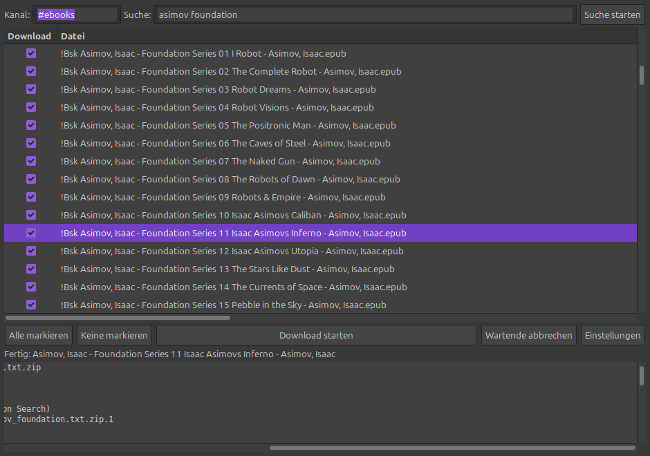

# EbookDL – HexChat-Plugin für IRC-Ebook-Suche & Download

> English? The English version of this guide is in
> [README.md](README.md).

EbookDL automatisiert die Ebook-Suche und den Download über die
"bookz"-Bots im IRC (z. B. `#bookz` oder `#ebooks` auf
`irc.irchighway.net`) — komplett in einem Fenster, mit Netiquette-Queue:

1. **Suchen**: sendet `@search <begriff>` in den Channel
2. **Ergebnisse**: empfängt die Ergebnis-ZIP per DCC, entpackt sie und
   parst die Trefferliste (Dateiname + Größe)
3. **Auswählen**: Treffer in einer scrollbaren Liste mit Checkboxen
4. **Herunterladen**: markierte Bücher werden nacheinander angefordert
   und per DCC empfangen
5. **Ablage**: fertige Dateien landen im Zielordner (echte Archive werden
   optional entpackt — E-Book-Dateien wie EPUB bleiben unangetastet)
6. **Überblick**: Statuszeile, Fortschrittsbalken und Log im Fenster

Lizenz: **MIT** (siehe LICENSE). Bitte die Regeln des jeweiligen
IRC-Netzwerks/Channels respektieren — die Netiquette-Vorgaben sind im
Plugin standardmäßig eingestellt und anpassbar.

---

## Funktionen im Überblick

- Such- und Download-Fenster direkt aus HexChat (`/ebookdl`)
- Automatische Erkennung der Ergebnis-ZIP (kein manuelles Öffnen nötig)
- Trefferliste mit Größenangabe, Checkboxen und Status-Spalte
- Sortierbare Liste: Klick auf die Kopfzeile sortiert nach Name
  (case-insensitive), Dateityp oder Größe (numerisch)
- **Feste Spaltenbreiten**: Beim Öffnen des Fensters und nach dem Einlesen
  von Ergebnissen sind alle Spalten sichtbar — lange Dateinamen und
  Ziel-Pfade werden mit `…` abgeschnitten statt die Spalten aufzuziehen
  (die Datei-Spalte lässt sich weiterhin per Maus anpassen)
- **E-Book-Filter**: Standardmäßig werden in den Treffern nur E-Books und
  Archive angezeigt — Cover-Bilder, OPF-, NFO- und ähnliche Dateien
  werden ausgeblendet (das Log zeigt, wie viele gefiltert wurden; die
  Option lässt sich in den Einstellungen abschalten)
- Warteschlange mit strikter Netiquette: eine Anfrage pro Pause-Intervall,
  begrenzte parallele Downloads, Timeouts
- DCC-Zuordnung per Bot-Nick und Dateiname (mit FIFO-Fallback)
- Nach erfolgreichem Download wird das Buch automatisch abgewählt —
  fertige Titel verschwinden so aus der Auswahl (Fehler bleiben markiert,
  damit du sie erneut versuchen kannst)
- Zielordner, Pausen, Parallelität und Suchbefehl konfigurierbar
- Ergebnis-ZIPs werden nach dem Parsen automatisch gelöscht
- **Einzelinstanz-Schutz**: Das Plugin kann nur einmal geladen werden —
  weitere Ladungen (auch aus anderen Pfaden) werden mit einer Meldung
  abgewiesen, keine doppelten Fenster/Hooks
- Läuft in HexChats GTK2 — kein separates Fenster-Management nötig

---

## Voraussetzungen

**Linux**

- HexChat (≥ 2.14, Python-Scripting aktiv — Standard)
- Python 3 + PyGObject mit GTK2-Typelibs für das Fenster:

      sudo apt-get install python3-gi gir1.2-gtk-2.0

**Windows**

- HexChat (offizieller Installer, enthält die Python-Integration)
- Die GUI benötigt PyGObject (`gi`) mit Gtk-2.0-Typelibs — im
  Windows-Installer in der Regel nicht enthalten. Ohne diese meldet das
  Plugin beim Öffnen einen Hinweis; die Such-/Download-Logik (Hook-
  basiert) läuft trotzdem, nur ohne Fenster.

---

## Installation

### Linux

1. Plugin-Datei in den Autoload-Ordner legen. **Wichtig:** Python-Skripte
   laden aus `addons/`, nicht aus `plugins/`:

       mkdir -p ~/.config/hexchat/addons
       cp ebookdl.py ~/.config/hexchat/addons/
       # oder Symlink, wenn du im Repo weiterentwickelst:
       ln -s "$PWD/ebookdl.py" ~/.config/hexchat/addons/ebookdl.py

2. HexChat neu starten (oder im laufenden HexChat `/py load /pfad/zu/ebookdl.py`
   eingeben). Das Plugin lädt, sobald eine IRC-Verbindung steht.
3. Fenster öffnen: `/ebookdl` in die Eingabezeile tippen.

### Windows

1. HexChat installieren und einmal verbinden.
2. `ebookdl.py` nach `%APPDATA%\HexChat\addons\` kopieren.
3. HexChat neu starten, `/ebookdl` tippen.

### Deinstallation

- Datei aus `~/.config/hexchat/addons/` (bzw. `%APPDATA%\HexChat\addons\`)
  entfernen und HexChat neu starten — oder zur Laufzeit:
  `/py unload EbookDL`.

---

## Erste Schritte (Schnellstart)

1. In einen Ebook-Channel wechseln (z. B. `/join #ebooks` auf
   irc.irchighway.net) — oder den Kanal später in den Einstellungen fest
   hinterlegen.
2. `/ebookdl` eingeben — das Fenster öffnet sich.
3. Suchbegriff ins Feld **Suche** tippen, Enter drücken (oder
   **Suche starten**). Der Status zeigt *Suche läuft …*.
4. Sobald der Bot antwortet, erscheint unten im Log
   *Ergebnis-Datei wird empfangen* und danach die Trefferzahl, z. B.
   *855 Treffer – Bücher markieren und Download starten*.
5. In der Liste Bücher mit Häkchen markieren und **Download starten**
   klicken. Die Anfragen gehen mit Pause raus, die Dateien landen im
   Zielordner (Standard: `~/Downloads/ebooks`).

---

## Bedienung im Detail

### Das Fenster

| Bereich            | Inhalt                                                              |
|---------------------|---------------------------------------------------------------------|
| Kopfzeile           | Kanal-Feld (Anzeige), Suchfeld, **Suche starten**-Button            |
| Tabelle             | Checkbox, Dateiname, **Dateityp** (Endung), Größe, Status           |
| Button-Leiste       | Alle markieren / Keine markieren / Download starten / Wartende abbrechen / Einstellungen |
| Fortschrittsbereich | Statuszeile, Fortschrittsbalken, Log mit Zeitstempel                |

**Sortieren**: Klick auf eine Kopfzeile sortiert die Liste — **Datei**
(case-insensitive), **Typ** (alphabetisch) oder **Größe** (numerisch).
Ein zweiter Klick kehrt die Reihenfolge um; der Pfeil in der Kopfzeile
zeigt die aktive Sortierung.

### Suche

- **Suchfeld**: Begriff eingeben, Enter drücken. Gesendet wird
  `@search <begriff>` (der Befehl ist in den Einstellungen änderbar).
- **Kanal**: Ist das Kanal-Feld leer, wird der aktuell aktive Channel
  verwendet. Steht dort ein Kanal (aus den Einstellungen), geht die Suche
  dorthin.
- **Während einer laufenden Suche** wird eine zweite Suche mit
  *Suche läuft bereits – bitte warten.* abgelehnt.
- **Ergebnis**: Der Bot sendet eine ZIP per DCC. Das Plugin erkennt sie
  automatisch (*Ergebnis-Datei wird empfangen*), entpackt sie im
  Hintergrund, parst die Treffer und befüllt die Liste. Die ZIP wird
  danach gelöscht (*Ergebnis-ZIP gelöscht*).
- **Timeout**: Kommt innerhalb des Such-Timeout (Standard 180 s) keine
  Datei, wird abgebrochen (*Timeout: Keine Ergebnis-Datei empfangen.*).

### Ergebnisliste

- Jede Zeile: **Checkbox** (Häkchen = ausgewählt), **Dateiname**,
  **Größe**, **Status** (wird beim Download gefüllt).
- **Alle markieren / Keine markieren** setzt bzw. entfernt alle Häkchen.
- Die Auswahl bleibt beim Schließen des Fensters erhalten (die
  Ergebnisliste wird fensterunabhängig gespeichert) — beim erneuten
  Öffnen ist sie wieder da.

### Download

- **Download starten**: Alle markierten Bücher werden in die
  Warteschlange eingereiht (*N Download(s) eingereiht*).
- Die Anfragen werden **einzeln mit Pause** (Standard 10 s) gesendet;
  gleichzeitig laufen höchstens `max_concurrent` Downloads (Standard 2).
- Die Status-Spalte zeigt den Fortschritt jeder Zeile:
  `wartend → angefragt → empfange → fertig` (bzw. `Fehler`).
- **Wartende abbrechen** entfernt alle noch nicht gesendeten Anfragen.
- Bei Abschluss wird die Datei in den Zielordner **verschoben**
  (nicht kopiert). **Echte Archive** (zip, 7z, rar, tar/tar.gz/tar.bz2/
  tar.xz/tgz, cab, iso, arj, lzh sowie einzeln komprimierte gz/bz2/xz)
  werden optional entpackt — zip nativ, der Rest über das installierte
  `7z` (p7zip). **E-Book-Dateien wie EPUB (technisch eine ZIP-Datei)
  bleiben bewusst unangetastet.** Namenskollisionen bekommen automatisch
  ` (1)`, ` (2)`, … angehängt.
- **Automatische Abwahl**: Nach erfolgreichem Download wird das Häkchen
  der Zeile entfernt — du siehst sofort, was noch fehlt. Fehlgeschlagene
  Downloads bleiben markiert (Status `Fehler`), damit du sie erneut
  anfordern kannst.
- Ein Download, der innerhalb des Timeouts (Standard 300 s) keinen
  Empfang startet, wird als Fehler markiert.

### Fortschrittsbereich

- **Statuszeile**: fasst den aktuellen Zustand zusammen (Suche, Treffer,
  laufender Download, Fehler).
- **Fortschrittsbalken**: erscheint während der Downloads.
- **Log**: zeitgestempelte Meldungen des Plugins (Suche gesendet,
  Empfang, Parsing, Downloads, Fehler).

---

## Einstellungen

- **Einstellungen** im Fenster öffnet ein modales Fenster (blockiert das
  Hauptfenster, solange es offen ist — ein zweiter Klick holt es nur nach
  vorn). **OK** speichert, **Abbrechen** oder Fenster schließen verwirft.
  Wird das Hauptfenster geschlossen, schließt das Einstellungen-Fenster
  automatisch mit. Alle Werte werden in `~/.config/hexchat/ebookdl.json`
  (bzw. `%APPDATA%\HexChat\ebookdl.json`) gespeichert und beim Start
  geladen.

| Option               | Standard                    | Bedeutung                                             |
|----------------------|-----------------------------|-------------------------------------------------------|
| Kanal                | (leer)                      | Fester Kanal für Suche/Downloads; leer = aktueller    |
| Suchbefehl           | `@search {query}`           | Vorlage; `{query}` wird durch den Begriff ersetzt     |
| Zielordner           | `~/Downloads/ebooks`        | Ablage der fertigen Dateien                           |
| Pause zwischen Anfragen | 10 s                     | Mindestabstand zwischen zwei Anfragen (Netiquette)   |
| Max. parallele Downloads | 2                       | gleichzeitig laufende Downloads                       |
| Download-Timeout     | 300 s                       | Abbruch, wenn kein Empfang beginnt                    |
| Such-Timeout         | 180 s                       | Abbruch der Suche ohne Ergebnisdatei                  |
| ZIP entpacken        | an                          | Archive im Zielordner automatisch entpacken           |
| E-Book-Filter        | an                          | In den Treffern nur E-Books und Archive anzeigen (Cover-Bilder, OPF, NFO usw. ausblenden); das Log meldet, wie viele Dateien ausgeblendet wurden |
| Konvertierung        | aus                         | Nach dem Download automatisch nach **EPUB**, **MOBI** oder **PDF** konvertieren (Calibre). Ist `ebook-convert` nicht installiert, ist die Auswahl ausgegraut und ein Hinweis erscheint (`sudo apt install calibre`). Konvertierung läuft nach dem Verschieben; Fehlschläge lassen die Originaldatei unangetastet. |

---

## Konvertierung (Calibre)

Nach dem Download kann das Plugin das Buch automatisch nach **EPUB**,
**MOBI** oder **PDF** konvertieren — nützlich, weil viele Bücher in den
bookz-Netzwerken als `.lit` oder andere Formate verteilt werden.

- Zielformat in den Einstellungen wählen (Option **Konvertierung**).
- Die Konvertierung läuft, nachdem die Datei in den Zielordner
  verschoben wurde.
- Es werden nur E-Book-Dateien konvertiert (Archive niemals), und nur,
  wenn sich das Zielformat vom Quellformat unterscheidet.
- Schlägt die Konvertierung fehl, bleibt die Originaldatei unangetastet
  und der Fehler erscheint im Log.

**Abhängigkeit:** Für die Konvertierung wird
[Calibre](https://calibre-ebook.com) benötigt — genauer dessen
Kommandozeilen-Tool `ebook-convert`. Ist Calibre nicht installiert, ist
die Format-Auswahl in den Einstellungen ausgegraut und ein Hinweis
erscheint.

Installation unter Debian/Ubuntu/Mint:

    sudo apt install calibre

oder Download von der [Calibre-Website](https://calibre-ebook.com/download).

---

## Netiquette & Warteschlange

Die bookz-Netzwerke erwarten maßvolles Verhalten. EbookDL setzt das
standardmäßig um und gibt es nicht auf:

- **Eine Anfrage pro Pause-Intervall** — auch wenn viele Bücher markiert
  sind, wird höchstens alle `delay` Sekunden eine Anfrage gesendet.
- **Max. `max_concurrent` aktive Downloads** — weitere Anfragen warten in
  der Queue, bis ein Download abgeschlossen oder fehlgeschlagen ist.
- **Timeouts** verhindern, dass hängende Suchvorgänge oder Downloads die
  Queue blockieren.
- **Kein Spam**: Der Suchbefehl ist konfigurierbar, die Anfragen werden
  exakt aus der Trefferliste erzeugt (keine Eigenkonstrukte).

---

## Sprache

Die Plugin-Oberfläche (Fenster, Buttons, Spalten, Log- und Statusmeldungen)
folgt automatisch der Sprache von HexChat — Deutsch oder Englisch. Es wird
dieselbe Locale-Priorität wie bei HexChat/gettext verwendet:
`LANGUAGE` → `LC_ALL` → `LC_MESSAGES` → `LANG`.

Hinweis: Eine gesetzte `LANGUAGE`-Variable überschreibt `LANG`. Wer
deutsch starten will, obwohl die System-Locale englisch ist:

    LANGUAGE=de hexchat

bzw. dauerhaft über eine `.desktop`-Datei oder
`~/.config/environment.d/language.conf` mit `LANGUAGE=de`.

---

## Fehlerbehebung

| Problem | Lösung |
|---------|--------|
| `/ebookdl` → *Unknown command* | Plugin nicht geladen. Liegt `ebookdl.py` in `~/.config/hexchat/addons/`? Prüfen mit `/py list` (Eintrag *EbookDL*), nachladen mit `/py load /pfad/ebookdl.py`. HexChat muss einmal verbunden sein. |
| Fenster öffnet nicht, Meldung *GUI-Bindings fehlen* | `python3-gi` / `gir1.2-gtk-2.0` installieren (Linux) bzw. PyGObject bereitstellen (Windows). Such-/Download-Logik läuft trotzdem. |
| *FEHLER: Kein Kanal* | In einen Channel wechseln oder Kanal in den Einstellungen festlegen. |
| Ergebnis-ZIP kommt an, aber keine Treffer | Ergebnisdatei nicht gefunden oder Parse-Fehler — Log beachten; ggf. Timeout erhöhen. |
| Downloads bleiben bei *angefragt* | Bot hat nicht geantwortet (offline/anderer Name). Timeout markiert die Zeile als Fehler; prüfen, ob der Bot im Kanal aktiv ist. |
| Datei landet nicht im Zielordner | Zielordner in den Einstellungen prüfen (Schreibrechte); das Plugin verschiebt nur nach erfolgreichem DCC-Empfang. |
| Mehrere EbookDL-Fenster nach Reloads | Seit Version mit Einzelinstanz-Schutz nur noch eine Instanz möglich. Zum bewussten Neuladen: EbookDL-Fenster schließen, dann `/py unload EbookDL` und `/py load /pfad/ebookdl.py`. |

---

## Wie es funktioniert (Technik)

1. **Suche**: Das Plugin sendet den Suchbefehl (Standard `@search <begriff>`)
   als Nachricht in den Kanal. Die bookz-Bots antworten mit einer ZIP-Datei
   per DCC (Dateiname z. B. `SearchBot_results_for__begriff.txt.zip`).
2. **Erkennung**: Eingehende DCC-Transfers meldet HexChat über die
   Print-Events `DCC RECV Connect` und `DCC RECV Complete` (Achtung:
   `DCC Offer` ist das Event für *ausgehende* Angebote). EbookDL lauscht
   auf diese Events, erkennt die Ergebnis-ZIP am Dateinamen und parst sie
   in einem Hintergrund-Thread.
3. **Parsen**: Die ZIP enthält eine Textdatei mit Zeilen wie
   `!bot id | datei.pdf ::INFO:: 49.78MB`. Das Plugin extrahiert
   Dateiname, Größe und Bot-Nick und baut daraus die Liste.
4. **Download**: Für markierte Zeilen wird der Teil vor `::INFO::`
   (der `!`-Request) als Nachricht gesendet. Der Bot schickt die Datei per
   DCC; die Zuordnung zur Zeile erfolgt über Bot-Nick → Dateiname → FIFO.
   Nach dem Empfang verschiebt das Plugin die Datei in den Zielordner
   (ZIPs werden entpackt).
5. **Netiquette**: Die Queue sendet strikt eine Anfrage pro Intervall und
   begrenzt die parallelen Transfers (siehe oben).

### Wichtige HexChat-Python-API-Erkenntnisse (für Entwickler)

- In Print-Hook-Callbacks beginnt das `word[]`-Array mit dem **ersten
  Argument** des Events (`word[0]` = $1) — der Event-Name steht NICHT im
  Array (die Python-Bridge verschiebt; im C-API ist es anders).
  Beispiel `DCC RECV Connect` → `word = [nick, host, dateiname]`.
- **`DCC Offer` feuert nicht bei eingehenden Dateien** (nur bei
  ausgehenden). Eingehende Transfers: `DCC RECV Connect` (Beginn) und
  `DCC RECV Complete` (fertig; `word = [dateiname, zielpfad, nick, cps]`).
- Event-Namen (hookbar) exakt wie in `src/common/textevents.in`.
- **Gtk2-Typelib-Limits** (Ubuntu): viele Konstruktoren nehmen keine
  Argumente (`Gtk.TreeView(model)` etc. schlagen fehl) — das Plugin nutzt
  deshalb konsequent das Muster `Widget()` + Setter. `Gtk.Dialog().run()`
  kann im HexChat-Kontext einen Segfault auslösen — die Einstellungen
  sind deshalb ein eigenes Fenster mit OK/Abbrechen.
- `/py reload` hinterlässt alte Fenster als "Zombies" mit weiterhin
  registrierten Hooks (GTK hält die Plugin-Objekte am Leben) — zum Testen
  `unload` + `load` oder Neustart verwenden.
- Die Python-API hat **kein** `hexchat.set_prefs` — Präferenzen
  (`dcc_auto_recv` usw.) werden über `/set` via `hexchat.command()` gesetzt.

---

## Entwicklung & Tests

Das Plugin ist ein einzelnes Python-Skript (kein Build nötig).

    python3 test_ebookdl.py          # Unit-Tests (HexChat-Stub, ohne GUI/IRC)

Struktur:

- `ebookdl.py` – das Plugin (Hooks, Queue, Parser, GUI)
- `test_ebookdl.py` – Test-Harness mit gemocktem `hexchat`-Modul
- `screenshots/` – Screenshots für die Doku

---

## Lizenz & Haftung

MIT-Lizenz, siehe [LICENSE](LICENSE). Copyright © 2026 Kalrkloss.

Dieses Projekt ist ein Werkzeug zur Automatisierung öffentlicher
IRC-Kanal-Funktionen. Bitte halte dich an die Regeln des jeweiligen
Netzwerks und Channels; der Autor übernimmt keine Haftung für die Nutzung
oder die heruntergeladenen Inhalte.
